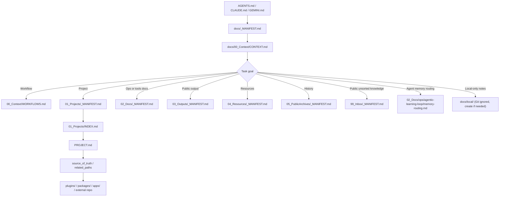

# Platform Context

This file is the main context and navigation layer for `docs/`.

AI agents must not edit this file unless the user explicitly asks to edit `docs/00_Context/CONTEXT.md`.

## Repository

`platform` is the OyasaiServer monorepo.

It contains Minecraft server plugins, infrastructure packages, Nix build definitions, local development server assets, and public documentation for contributors and AI agents.

## Core Stack

| Area | Primary paths | Notes |
|---|---|---|
| Minecraft plugins | `plugins/` | Kotlin / Java / Paper / Purpur plugins |
| Build system | `build.gradle.kts`, `gradle/`, `gradle.lock` | Gradle-based build |
| Reproducible env | `flake.nix`, `nix/` | Use `/nix/var/nix/profiles/default/bin/nix` if `nix` is not on PATH |
| Packages / infra | `packages/` | Nix-buildable packages and generated providers |
| Local runtime | `dev-server/`, `local/` | Local-only runtime state is not the docs SOT |
| Documentation | `docs/` | Public shared docs and AI entrypoints |

## Docs Structure

```text
docs/
  _MANIFEST.md          Constitution. Protected. Points here.
  README.md             Human-readable overview and diagrams.
  AGENTS.md             Thin AI entrypoint. Points to _MANIFEST.md.
  CLAUDE.md             Thin Claude entrypoint. Points to _MANIFEST.md.
  GEMINI.md             Thin Gemini entrypoint. Points to _MANIFEST.md.
  00_Context/
    CONTEXT.md          This file. Repo context, docs structure, routing.
    WORKFLOWS.md        Shared agent workflow procedures.
  01_Projects/
    _MANIFEST.md        Project directory rules.
    INDEX.md            Project index, if maintained.
    <category>/<project>/PROJECT.md
  02_Docs/
    _MANIFEST.md        Cross-cutting docs and ops rules.
    ops/
    tools/
  03_Outputs/
    _MANIFEST.md        Public generated outputs and validation results.
  04_Resources/
    _MANIFEST.md        Small public resources and examples.
  05_PublicArchives/
    _MANIFEST.md        Public deprecated or historical docs.
  99_Inbox/
    _MANIFEST.md        Public unsorted knowledge area.
  local/                Git-ignored local-only notes, if needed.
```

## Read Routing

Read only what is needed for the task.

| Goal | Read next |
|---|---|
| Understand docs at a human level | `docs/README.md` |
| Follow a PR, docs, plugin, or dev-server workflow | `docs/00_Context/WORKFLOWS.md` |
| Add or update a project page | `docs/01_Projects/_MANIFEST.md` |
| Edit a plugin | use `docs/01_Projects/INDEX.md` to find the plugin `PROJECT.md`, then `plugins/<Plugin>/` |
| Work on a Minecraft-related non-plugin tool | target `docs/01_Projects/tools/<tool>/PROJECT.md` |
| Update cross-cutting operations or tool docs | `docs/02_Docs/_MANIFEST.md` |
| Store public validation output | `docs/03_Outputs/_MANIFEST.md` |
| Store small public examples or samples | `docs/04_Resources/_MANIFEST.md` |
| Check old public docs | `docs/05_PublicArchives/_MANIFEST.md` |
| Store public but unsorted knowledge | `docs/99_Inbox/_MANIFEST.md` |
| Route agent memory, corrections, or local-only notes | `docs/02_Docs/ops/agentic-learning-loop/memory-routing.md` |
| Keep private, local, raw, or unresolved notes | `docs/local/` if needed; it is Git-ignored and may be created by agents |

## Read Flow



## Editing Rules

- `docs/_MANIFEST.md` and this file are protected. Edit them only when the user explicitly asks.
- Keep common procedures in `WORKFLOWS.md`.
- Keep project-specific context in `PROJECT.md`.
- Keep directory-specific rules in child `_MANIFEST.md` files.
- Keep `README.md` human-readable, visual, and comprehensive.
- Do not duplicate shared rules in adapter files such as `AGENTS.md`, `CLAUDE.md`, or `GEMINI.md`.
- Use `docs/local/` for local-only docs memory when needed. It may be created by agents and is intentionally not tracked by Git.

## Build And Validation Basics

- Format: `/nix/var/nix/profiles/default/bin/nix fmt`
- Build through Nix when possible: `/nix/var/nix/profiles/default/bin/nix develop --command gradle <task>`
- Do not use `gradle fmt`; CI uses treefmt through Nix.
- `detekt 1.23.6 + Java 25` can produce `IllegalArgumentException: 25`; treat it as a known environment issue unless evidence says otherwise.

For detailed procedures, read `docs/00_Context/WORKFLOWS.md`.
