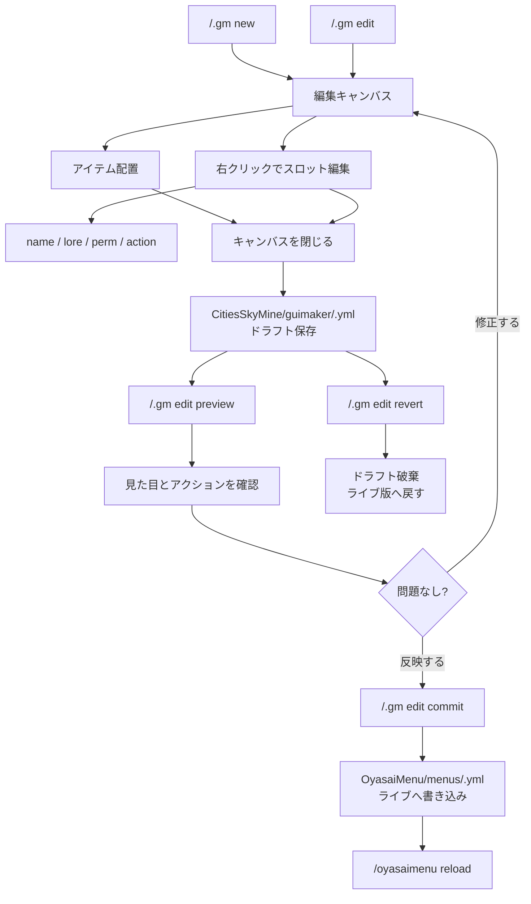

# GuiMaker 使用ガイド

CitiesSkyMine に内蔵された OyasaiMenu 用 ChestGUI エディターです。
メニューの YAML をゲーム内で作成し、ドラフトとして保存してから OyasaiMenu に反映します。

`/.gm` は OP 限定です。

## コマンド構造

基本ルールは `/.gm edit <menu-id> <操作>` です。
メニューを変更する操作はすべて `edit <menu-id>` の下に入ります。

| コマンド | 説明 |
|---|---|
| `/.gm new <id>` | 新規メニューを作成し、キャンバスを開く |
| `/.gm edit <id>` | 既存メニューまたはドラフトを開く |
| `/.gm edit <id> canvas` | 編集キャンバスを開き直す |
| `/.gm edit <id> preview` | 現在の編集内容をプレビューする |
| `/.gm edit <id> commit` | ドラフトを OyasaiMenu のライブ YAML に反映して reload する |
| `/.gm edit <id> revert` | ドラフトを破棄してライブ版に戻す |
| `/.gm edit <id> info` | 編集中メニューの状態を表示する |
| `/.gm edit <id> discard` | 自分の編集セッションだけを破棄する |
| `/.gm list` | 既存メニューIDを表示する |

## 編集操作

| コマンド | 説明 |
|---|---|
| `/.gm edit <id> title [text]` | タイトルを変更する。`text` なしならカラーピッカーを開く |
| `/.gm edit <id> name <slot> <text>` | スロットの表示名を設定する |
| `/.gm edit <id> lore <slot> <text>` | スロットの lore を1行追加する |
| `/.gm edit <id> clearlore <slot>` | スロットの lore を全削除する |
| `/.gm edit <id> perm <slot> [permission]` | その権限を持つプレイヤーだけにスロットを表示する |
| `/.gm edit <id> action <slot> <type> [value]` | スロットのクリックアクションを追加する |
| `/.gm edit <id> clearactions <slot>` | スロットのアクションを全削除する |
| `/.gm edit <id> clearslot <slot>` | スロットのアイテムと設定を削除する |

例:

```text
/.gm new hoge
/.gm edit hoge title &8メインメニュー
/.gm edit hoge name 10 &aショップ
/.gm edit hoge lore 10 &7クリックでショップを開く
/.gm edit hoge action 10 OPEN_POPUP shopindex
/.gm edit hoge preview
/.gm edit hoge commit
```

## キャンバスとプレビュー

| 画面 | 目的 | クリック時の挙動 | 保存 |
|---|---|---|---|
| キャンバス | メニューを編集する画面 | アイテム配置、右クリックでスロット編集 | 閉じるとドラフト保存 |
| プレビュー | 現在の編集内容を動作確認する画面 | 設定済みアクションを実行 | 保存しない |

キャンバスは編集用です。アイテムを置いたり動かしたり、右クリックで名前、lore、権限、アクションを編集します。

プレビューは現在の編集セッションのスナップショットです。OyasaiMenu に commit する前に見た目とクリック動作を確認できます。ただし `CONSOLE_CMD` や `OP_PLAYER_CMD` などはプレビューでも実際に実行されます。

## 編集メニューの操作感

スロット編集、アクション選択、カラー選択、メニュー選択は OyasaiMenu の `/mn` や `/mn u` に近い構造です。

- 上45スロット: 編集内容、カテゴリ見出し、選択肢
- 下段45-53: 共通操作バー
- 45: 編集中メニュー情報
- 46: キャンバス
- 47: プレビュー
- 48: ライブへ反映
- 49: 情報表示
- 50: タイトル変更
- 51: commit 済みのライブ表示
- 52: 閉じる
- 53: 前の編集画面へ戻る

キャンバス自体にはこの操作バーを出しません。キャンバスは作成中メニューの実物なので、54スロットをそのまま編集領域として使います。

スロット編集では、権限とサウンドも GUI から選べます。

- 権限設定: LuckPerms のグループをカテゴリ別に表示し、`lpgroup:<group>` として保存する
- 権限手入力: 特殊条件や従来の権限ノードを直接入力する
- ロア追加: 新しい lore 行を末尾に追加する
- ロア編集: lore 行の編集、順番入れ替え、個別削除、全削除を行う
- アクション追加: 新しいアクションを末尾に追加する
- アクション管理: 既存アクションの値編集、順番入れ替え、個別削除、全削除を行う
- サウンド設定: 左クリックで追加、右クリックで視聴のみ。音量は GUI 内で調整する
- 削除操作: lore クリア、アクション削除、スロットクリアは確認 GUI を挟む

`lpgroup:<group>` は OyasaiMenu 側で LuckPerms グループ所属として判定します。例えば `lpgroup:takumi` は、LuckPerms の `takumi` グループ所属者だけに表示する条件です。

## ワークフロー



## 保存先

| 種類 | パス | 説明 |
|---|---|---|
| ドラフト | `plugins/CitiesSkyMine/guimaker/<id>.yml` | 編集中の一時保存 |
| ライブ | `plugins/OyasaiMenu/menus/<id>.yml` | OyasaiMenu が実際に読み込む YAML |

`/.gm edit <id>` はドラフトを優先して読み込みます。ドラフトがなければライブ版を読み込みます。

## アクション

| 種類 | 例 | 値 |
|---|---|---|
| `OPEN_MENU` | `/.gm edit hoge action 10 OPEN_MENU city/main` | 通常メニューID |
| `OPEN_POPUP` | `/.gm edit hoge action 10 OPEN_POPUP shopindex` | ポップアップID |
| `PLAYER_CMD` | `/.gm edit hoge action 10 PLAYER_CMD spawn` | `/` なしのプレイヤーコマンド |
| `CONSOLE_CMD` | `/.gm edit hoge action 10 CONSOLE_CMD give %player% diamond 1` | `/` なしのコンソールコマンド |
| `OP_PLAYER_CMD` | `/.gm edit hoge action 10 OP_PLAYER_CMD gamemode creative` | 一時OPで実行するコマンド |
| `MESSAGE` | `/.gm edit hoge action 10 MESSAGE &aHello` | プレイヤーへのメッセージ |
| `BROADCAST` | `/.gm edit hoge action 10 BROADCAST &eNews` | 全体メッセージ |
| `URL` | `/.gm edit hoge action 10 URL https://example.com` | URL |
| `CHAT_PASTE` | `/.gm edit hoge action 10 CHAT_PASTE /tell ` | コピー用テキスト |
| `SUGGEST_COMMAND` | `/.gm edit hoge action 10 SUGGEST_COMMAND /tell ` | クリックでチャット欄に入るコマンド |
| `SOUND` | `/.gm edit hoge action 10 SOUND ui.button.click` | サウンドID |
| `CLOSE` | `/.gm edit hoge action 10 CLOSE` | 値なし |

`%player%` はクリックしたプレイヤー名に置換されます。

## メニューID

使用できる文字は英数字、`_`、`-`、`.`、階層用の `/` です。

例:

```text
main
shop/tools
city.osaka/main
```

`.` または `..` だけの階層は使えません。

## 整理したもの

以前の実装には `/.gm edit name ...` と `/.gm edit <id>` が同じ階層にあり、`name` というメニューIDと編集操作が衝突する構造でした。現在は `/.gm edit <id> name ...` の形に統一しています。

以下の旧形式は使いません。

```text
/.gm title
/.gm commit
/.gm preview
/.gm ctx
/.gm colorpick
/.gm actionmenu
```

`ctx`、`colorpick`、`actionmenu` は GUI 内部操作で足りるため、公開コマンドとしては不要です。

## YAML フォーマット

GuiMaker が出力する OyasaiMenu 用 YAML の基本形です。

```yaml
menu:
  title: '&8メニュータイトル'
  size: 54

items:
  item_10:
    slot: 10
    icon: DIAMOND
    name: '&bダイアモンド'
    lore:
      - '&7説明1行目'
      - '&7説明2行目'
    permission: lpgroup:takumi
    actions:
      - type: MESSAGE
        text: 'クリックしました'
      - type: SOUND
        sound: ui.button.click
        volume: '1.0'
```
