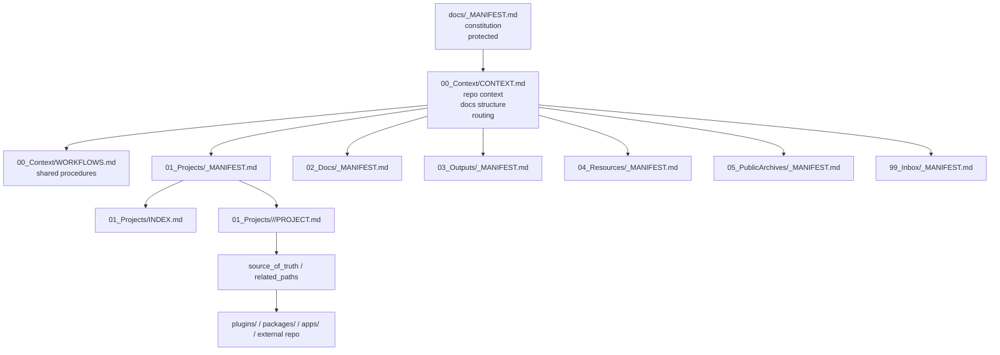

# Docs

Public shared documentation for contributors and AI agents.

Do not put personal information, secrets, private notes, raw personal logs, or large temporary outputs here.

## One-Screen Map

## Root Markdown

| File | Purpose |
|---|---|
| [`_MANIFEST.md`](_MANIFEST.md) | Constitution. AI agents must read this first. Protected from AI-only edits |
| [`README.md`](README.md) | Human-readable overview and diagrams |
| [`AGENTS.md`](AGENTS.md) | Thin AI entrypoint |
| [`CLAUDE.md`](CLAUDE.md) | Thin Claude entrypoint |
| [`GEMINI.md`](GEMINI.md) | Thin Gemini entrypoint |

## Context Markdown

| File | Purpose |
|---|---|
| [`00_Context/CONTEXT.md`](00_Context/CONTEXT.md) | Repository context, docs structure, and routing. Protected from AI-only edits |
| [`00_Context/WORKFLOWS.md`](00_Context/WORKFLOWS.md) | Shared workflow procedures for any AI agent |

## Directory Roles

| Directory | Manifest | Purpose |
|---|---|---|
| `01_Projects/` | [`01_Projects/_MANIFEST.md`](01_Projects/_MANIFEST.md) | Project pages and AI work entrypoints |
| `02_Docs/` | [`02_Docs/_MANIFEST.md`](02_Docs/_MANIFEST.md) | Cross-cutting docs, ops, and tool references |
| `03_Outputs/` | [`03_Outputs/_MANIFEST.md`](03_Outputs/_MANIFEST.md) | Public validation outputs and generated artifacts |
| `04_Resources/` | [`04_Resources/_MANIFEST.md`](04_Resources/_MANIFEST.md) | Small public samples and reference resources |
| `05_PublicArchives/` | [`05_PublicArchives/_MANIFEST.md`](05_PublicArchives/_MANIFEST.md) | Public deprecated or historical docs |
| `99_Inbox/` | [`99_Inbox/_MANIFEST.md`](99_Inbox/_MANIFEST.md) | Public triage area |

## Purpose Routing

| Goal | Read |
|---|---|
| Understand this docs design | `_MANIFEST.md`, then `00_Context/CONTEXT.md` |
| Make a PR | `00_Context/WORKFLOWS.md` |
| Update docs | target directory `_MANIFEST.md` |
| Add a project | `01_Projects/_MANIFEST.md`, then `01_Projects/INDEX.md` |
| Edit a plugin | target `01_Projects/minecraft-plugins/<plugin>/PROJECT.md`, then `plugins/<Plugin>/` |
| Work on a tool | target `01_Projects/tools/<tool>/PROJECT.md` |
| Check historical public docs | `05_PublicArchives/_MANIFEST.md` |

## Public vs Private Archive

| Location | Git status | Use |
|---|---|---|
| `docs/05_PublicArchives/` | tracked | Public deprecated docs and migration records |
| root `archive/` | ignored | Personal, temporary, local-only archive |
| root `local/` | ignored | Local runtime data and private scratch state |
