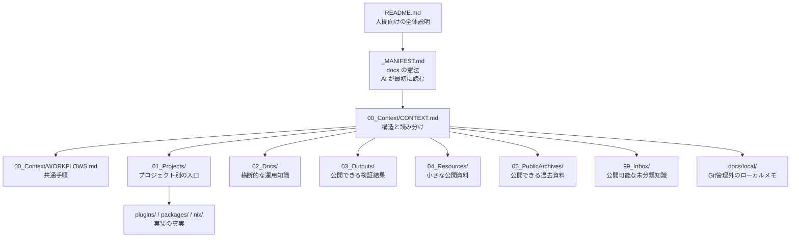

# docs について

この `docs/` フォルダーは、OyasaiServer の `platform` リポジトリで使う公開ドキュメント置き場です。

人間の共同作業者と AI エージェントが、同じ前提、同じ手順、同じ判断基準を読めるようにするための場所です。単なるメモ置き場ではなく、プロジェクトの状態、運用手順、AI が次回から同じ失敗をしないための知識を整理して残します。

個人情報、秘密情報、非公開のサーバー詳細、生ログ、個人的な作業メモはここに置きません。公開してよい内容だけを `docs/` に残します。

## まず読む場所

人間が全体像を知りたい場合は、この README から読み始めてください。

AI エージェントは次の順番で読みます。

1. [`_MANIFEST.md`](_MANIFEST.md)
2. [`00_Context/CONTEXT.md`](00_Context/CONTEXT.md)
3. 必要に応じて [`00_Context/WORKFLOWS.md`](00_Context/WORKFLOWS.md) や各ディレクトリの `_MANIFEST.md`

`_MANIFEST.md` は憲法のようなファイルです。公開境界、最初に読む場所、孤立した Markdown を作らないことなど、最小限の絶対ルールだけを書きます。

`00_Context/CONTEXT.md` は地図です。`docs/` 全体の構造と、目的別にどこを読むべきかを案内します。

`00_Context/WORKFLOWS.md` は手順書です。PR、docs 更新、プラグイン編集、AI の自己修正など、繰り返し使う作業手順をまとめています。

## 全体の地図

## ディレクトリの役割

| 場所 | 役割 |
|---|---|
| [`00_Context/`](00_Context/) | `docs/` 全体の前提、構造、作業手順 |
| [`01_Projects/`](01_Projects/) | 各プロジェクトの状態、入口、関連実装への案内 |
| [`02_Docs/`](02_Docs/) | 複数プロジェクトにまたがる運用手順、ツール資料、AI運用ルール |
| [`03_Outputs/`](03_Outputs/) | 公開してよい検証結果や生成物 |
| [`04_Resources/`](04_Resources/) | 小さな公開サンプル、参考資料 |
| [`05_PublicArchives/`](05_PublicArchives/) | 古くなったが公開してよい履歴資料 |
| [`99_Inbox/`](99_Inbox/) | 公開可能だが分類しきれない知識 |
| `docs/local/` | Git管理外のローカル専用メモ。必要な場合は AI が作成してよい |

## 公開用とローカル用

`docs/` は基本的に公開リポジトリの一部です。残す内容は、将来の共同作業者や AI エージェントが読んでも問題ないものに限ります。

| 場所 | Git追跡 | 用途 |
|---|---:|---|
| `docs/01_Projects/` | あり | プロジェクト別の公開コンテキスト |
| `docs/02_Docs/` | あり | 横断的な公開手順、運用知識 |
| `docs/99_Inbox/` | あり | 公開可能な未分類知識 |
| `docs/local/` | なし | 非公開、ローカル依存、生ログ、判断保留のメモ |
| ルート `local/` | なし | ローカルサーバーや実行時データ |
| ルート `archive/` | なし | 個人的・一時的な退避 |

`docs/local/` は、公開 docs に入れる前の下書きや、生ログ、ローカルサーバー調査、公開してよいか判断できないメモの置き場です。存在しない場合、AI エージェントは必要に応じて作成してよいです。

ただし、`docs/local/` の中身は Git に載らないため、公開ドキュメントとして残したい知識は、要約して `docs/99_Inbox/`、`docs/02_Docs/`、または該当する `PROJECT.md` に昇格します。

## AI エージェントを育てる仕組み

この `docs/` には、AI エージェントが次回からよりよく動くための知識も置きます。

中心になるのは [`02_Docs/ops/agentic-learning-loop/`](02_Docs/ops/agentic-learning-loop/) です。

| ファイル | 役割 |
|---|---|
| [`README.md`](02_Docs/ops/agentic-learning-loop/README.md) | AI の自己修正ループの考え方 |
| [`corrections.md`](02_Docs/ops/agentic-learning-loop/corrections.md) | ユーザーからの訂正を、次回の行動ルールとして残す場所 |
| [`memory-routing.md`](02_Docs/ops/agentic-learning-loop/memory-routing.md) | 知識を `docs/`、`99_Inbox/`、`docs/local/` のどこに置くかの判断基準 |

個人的な知識管理システムのように何でも保存するのではなく、`platform` では公開可能で、リポジトリ作業に役立つ知識だけを tracked docs に残します。

## どこに書くか迷ったら

| 内容 | 置き場所 |
|---|---|
| 特定プロジェクトの状態 | 該当する `01_Projects/.../PROJECT.md` |
| 何度も使う作業手順 | `00_Context/WORKFLOWS.md` または `02_Docs/ops/` |
| AI が次回から守るべき訂正 | `02_Docs/ops/agentic-learning-loop/corrections.md` |
| 公開できるが分類不能な知識 | `99_Inbox/` |
| 公開してよいか不明なメモ | `docs/local/` |
| 生ログやローカルサーバー調査 | `docs/local/` またはルート `local/` |
| 実装の正しい状態 | `plugins/`、`packages/`、`nix/` などの実装ディレクトリ |

迷った場合は、まず [`02_Docs/ops/agentic-learning-loop/memory-routing.md`](02_Docs/ops/agentic-learning-loop/memory-routing.md) を読んでください。

## 重要なルール

- `docs/` には公開してよい内容だけを書く。
- 実装の真実は、原則として `plugins/`、`packages/`、`nix/` などの実装側にある。
- 新しい Markdown を作ったら、どこかの `_MANIFEST.md`、`README.md`、`PROJECT.md`、`INDEX.md` から辿れるようにする。
- ただの生ログや長い作業履歴は公開 docs に入れない。
- AI の判断ミスを残す場合は、長い反省文ではなく、次回使える短い行動ルールにする。
