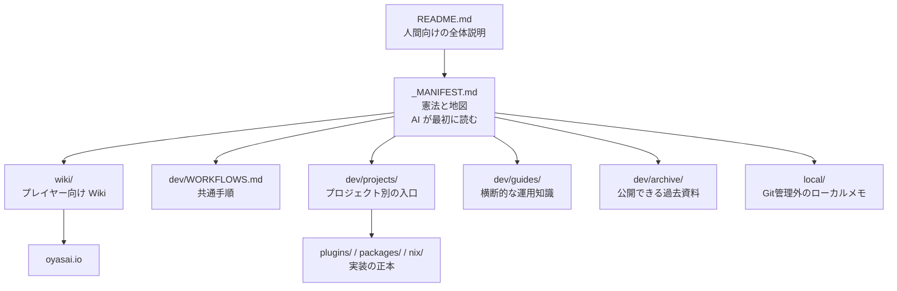

# docs について

この `docs/` フォルダーは、OyasaiServer の `platform` リポジトリで使う公開ドキュメント置き場です。中身は2つの区画に分かれています。

| 区画 | 読む人 | 役割 |
|---|---|---|
| [`wiki/`](wiki/_MANIFEST.md) | プレイヤー | おやさいサーバーの遊び方・ルール・機能の説明。oyasai.io で公開する |
| [`dev/`](dev/projects/INDEX.md) | 開発者と AI エージェント | 各プラグイン・ツールの入口、作業手順、運用知識。AI が迷わず開発を進めるための場所 |

個人情報、秘密情報、非公開のサーバー詳細、生ログ、個人的な作業メモはここに置きません。公開してよい内容だけを残します。

## まず読む場所

人間はこの README から、AI エージェントは [`_MANIFEST.md`](_MANIFEST.md) から読みます。`_MANIFEST.md` は「憲法」と「地図」を兼ねていて、作業ごとに次に読むページへのリンクを並べています。

## 全体の地図

```mermaid
flowchart TD
  Readme["README.md<br/>人間向けの全体説明"]
  Root["_MANIFEST.md<br/>憲法と地図<br/>AI が最初に読む"]
  Wiki["wiki/<br/>プレイヤー向け Wiki"]
  Workflows["dev/WORKFLOWS.md<br/>共通手順"]
  Projects["dev/projects/<br/>プロジェクト別の入口"]
  Guides["dev/guides/<br/>横断的な運用知識"]
  Archive["dev/archive/<br/>公開できる過去資料"]
  Local["local/<br/>Git管理外のローカルメモ"]
  Impl["plugins/ / packages/ / nix/<br/>実装の正本"]
  Site["oyasai.io"]

  Readme --> Root
  Root --> Wiki
  Root --> Workflows
  Root --> Projects
  Root --> Guides
  Root --> Archive
  Root --> Local
  Projects --> Impl
  Wiki --> Site
```

## ページ同士のつながり

ページは相対リンク（例: `[SocialLikes3](../sociallikes3/PROJECT.md)`）でつなぎます。GitHub でも、公開サイトでも、Obsidian のグラフビューでもリンクとして動きます。

- 新しいページを作ったら、少なくとも1つのページからリンクする。
- 関連するプロジェクト・手順・Wiki ページに触れたら、リンクにする。各 `PROJECT.md` の「つながり」欄が関係の一覧になる。
- 移動や追加のあとは `python3 docs/dev/check_links.py` でリンク切れと孤立ページを確認する。

## 公開用とローカル用

| 場所 | Git追跡 | 用途 |
|---|---:|---|
| `docs/wiki/` | あり | プレイヤー向けの公開ページ |
| `docs/dev/` | あり | 開発者と AI 向けの公開コンテキスト |
| `docs/local/` | なし | 非公開、ローカル依存、生ログ、判断保留のメモ。生成物の退避先 |
| ルート `local/` | なし | ローカルサーバーや実行時データ |
| ルート `archive/` | なし | 個人的・一時的な退避 |

`docs/local/` の中身は Git に載りません。残したい知識は要約して、該当する `PROJECT.md` か `dev/guides/` に昇格します。

## AI エージェントを育てる仕組み

AI が次回からよりよく動くための知識は [`dev/guides/ops/agentic-learning-loop/`](dev/guides/ops/agentic-learning-loop/README.md) に置きます。

| ファイル | 役割 |
|---|---|
| [`README.md`](dev/guides/ops/agentic-learning-loop/README.md) | AI の自己修正ループの考え方 |
| [`corrections.md`](dev/guides/ops/agentic-learning-loop/corrections.md) | ユーザーからの訂正を、次回の行動ルールとして残す場所 |
| [`memory-routing.md`](dev/guides/ops/agentic-learning-loop/memory-routing.md) | 知識を公開 docs と `docs/local/` のどちらに置くかの判断基準 |

## どこに書くか迷ったら

| 内容 | 置き場所 |
|---|---|
| プレイヤーに伝えたい説明 | `wiki/` |
| 特定プロジェクトの状態・設計の理由 | 該当する `dev/projects/.../PROJECT.md` |
| 何度も使う作業手順 | [`dev/WORKFLOWS.md`](dev/WORKFLOWS.md) または `dev/guides/ops/` |
| AI が次回から守るべき訂正 | `dev/guides/ops/agentic-learning-loop/corrections.md` |
| 公開してよいか不明なメモ | `docs/local/` |
| 実装の正しい状態 | `plugins/`、`packages/`、`nix/` などの実装ディレクトリ |

## 重要なルール

- `docs/` には公開してよい内容だけを書く。
- 実装の正本は、原則として `plugins/`、`packages/`、`nix/` などの実装側にある。
- ただの生ログや長い作業履歴は公開 docs に入れない。
- AI の判断ミスを残す場合は、長い反省文ではなく、次回使える短い行動ルールにする。
